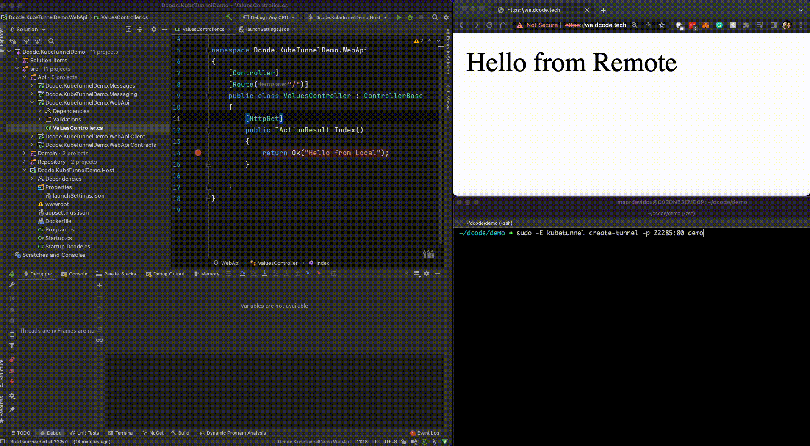
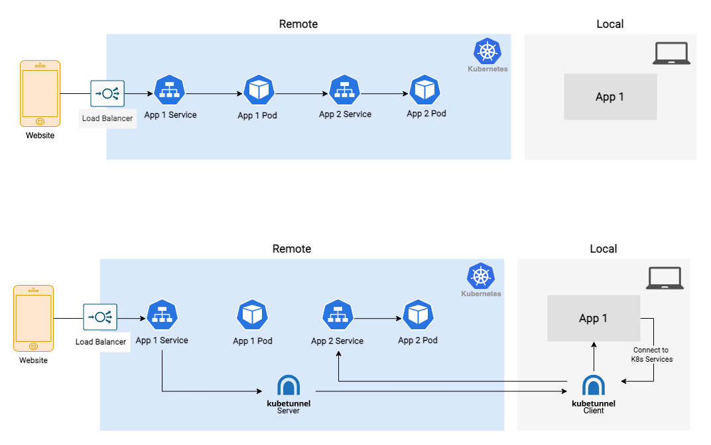

<p align="center" styles="background-color: white">
<br>
  by <a href="https://dcode.tech">Dcode</a>
</p>


# KubeTunnel: Develop locally while being connected to Kubernetes.



Website: [https://www.dcode.tech/](https://www.dcode.tech)  
Slack: [Discuss](https://we-dcode.slack.com/archives/C047WAUR41M)

**With KubeTunnel:**

* You run one service locally using your favorite IDE
* You run the rest of your microservices in Kubernetes, not limited to resources and compute power.

**This gives developers:**

* A fast local dev loop, with no waiting for a container build / push / deploy
* Ability to use their favorite local tools (IDE, debugger, etc.)
* Ability to run large-scale applications that can't run locally

---

## How It Works
1. You select a **Kubernetes service** and a **local process**.
2. Kubetunnel launches a pod on your namespace, and **changes the service** to move all traffic to this pod. This pod forwards all traffic to your local proccess through a secured tunnel.
3. The CLI then forwards all your Kubernetes services in your namespace to localhost. 

This creates a two way connection between your local process and the cluster meaning:

* All other pods now connect to your local process instead of the original pod in the cluster.
* You are able to connect to other services in the namespace from your local process.

Important: This tool is meant to be used only on development environments as all services will connect to you instead of the cluster.

You can read more about it [here](docs/Architecture.md).
<p align="center">
<br>
</p>

---
## Installation


Kubetunnel CLI can be installed through multiple channels.

### Linux/Mac

There are 2 methods to install the CLI on Linux/Mac.

1. Install Kubetunnel CLI from [Kubetunnel tap](https://github.com/kubetunnel/homebrew-tap) with [Homebrew](https://brew.sh) by running:

```bash
brew tap we-dcode/tap
brew install kubetunnel
```

2. Download the KubeTunnel CLI with the latest binary in our [releases page](https://github.com/we-dcode/kubetunnel/releases/latest). 

### Windows

Download the latest CLI binary in our [releases page](https://github.com/we-dcode/kubetunnel/releases/latest)


# Getting started with Kubetunnel CLI

Things to consider before you start:

* For this quickstart guide, your Kubernetes cluster is assumed to be already up and running. Before you proceed with the KubeTunnel installation, make sure you check the supported versions.
* Make sure your user has `cluster-admin` permissions for the initial installation of the operator component. For the tunnels themselves, this is not needed.
* The operator needs network access to each tunnel. If your namespaces deny ingress and egress traffic, please create NetworkPolicies to enable traffic between them as explained [here](docs/Network.md).
* You will need local administrator privileges to create each tunnel as the KubeTunnel client modifies the local hosts file to include the cluster services.

Once you installed the KubeTunnel CLI, you can verify it's working by running:

```bash
kubetunnel --help
```

For each of the following commands, you can run --help for more options.

### 1. Installing the Operator

To install the operator and CRDs **using the CLI**, run the following command:

```bash
kubetunnel install 
```

To install the operator **using a helm chart**, run the following commands:

```bash
helm repo add we-dcode https://we-dcode.github.io/kubetunnel
helm install we-dcode/kubetunnel-operator <release name>

```

At this point, the KubeTunnel Kubernetes Operator is successfully installed. Once the KubeTunnel Operator pod is running, you are able to start tunneling processes to your cluster. 

### 2. Creating a tunnel

For each Kubernetes service you want to tunnel, run the following command:

```bash
  sudo -E kubetunnel create-tunnel -p '8080:80' svc_name
```

This command waits for the local port to be available with the process you want to tunnel.  When the local process is up, it is tunneled to the cluster and the application service is switched to forward traffic to it.  If your local process becomes unavailable, the service is switched back to the original pod.

##  Autocomplete with Kubetunnel CLI

KubeTunnel supports completion for multiple shells.  
For autocomplete for your shell run the following command:

```bash
kubetunnel completion --help
```

# Known Limitations

* The current KubeTunnel version can only tunnel a single service per workstation. In the future, we will add support for multiple services.

##  Troubleshooting

**Q**: I'm not able to create a tunnel. What's going on?  

**A**: Check the following things before creating a tunnel:
1. You are able to connect to the cluster from your workstation. 
2. You have run the `kubetunnel install` command. 
3. You can check the logs of the operator pod:    
   a. Run the command `kubectl get pods -n <operator namespace>`   
   b. Observe the state of the pod. Is it running or in some kind of error?  
   c. Run `kubectl logs <operator pod name> -c manager`. Do you see any errors?  
4. The kubetunnel pods need to be able to connect to the operator pod. Are NetworkPolicies enabled on your cluster? If so, have you created them as seen [here](./docs/Network.md)
5. Check the logs of the kubetunnel pod itself. Has it been created? Does it have some kind of error?

**Q**: I'm not able to install the operator. What's going on?  

**A**: Check the following things before creating a tunnel:
1. You are able to connect to the cluster from your workstation. 
2. Installing the operator includes installing ClusterRoles, ClusterRoleBindings and CustomResourceDefinitions. Do you have the sufficient privileges to create these resources?
3. Are you using the latest version of the CLI? If not, try upgrading your version.


## Cleanup

To uninstall resources for a specific tunnel, find the specific tunnel you wish to delete and run the following commands:

```bash
kubectl get kubetunnel -n <requested namespace> 

# Search for the tunnel you wish to delete
kubectl delete kubetunnel <name>
```

To uninstall the operator itself, run the following command after deleting all kubetunnel resources:

```bash

helm ls -n <operator-namespace>
helm uninstall <release-name> -n <operator-namespace>
```


# Getting support

If you need support using KubeTunnel CLI, please [join our Slack channel](https://join.slack.com/t/we-dcode/shared_invite/zt-1kfg6u0d2-hICXM19FWTEP~PCWoyBZww).

Please leave issues for any error or bug that you encounter.

# Contributing

If you are an external contributor, before working on any contributions, please first [contact us](https://dcode.tech) to discuss the issue or feature request with us.

---

Made with 💙 by Dcode
