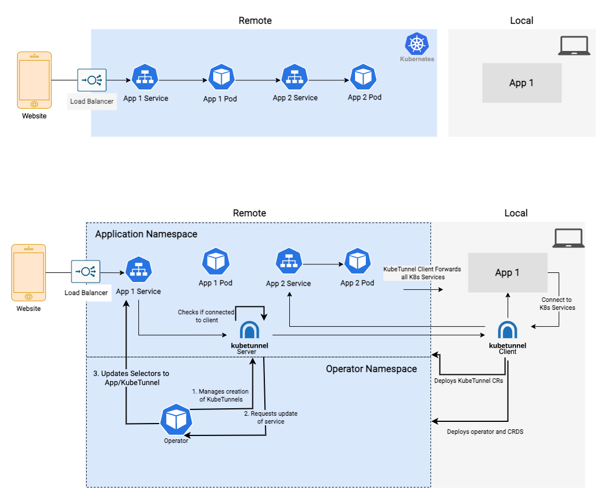

# KubeTunnel Networking

KubeTunnel uses 3 main components to manage tunnels in your Kubernetes Cluster.
1. The CLI installed locally.
2. The KubeTunnel deployment that is deployed in your application's namespace.
3. The KubeTunnel Operator deployed in it's own namespace.

The KubeTunnel deployments need access to the Operator to tell it if they are connected or disconencted to your local process. This happens through HTTP requests to the operator's REST API. This means:
1. There needs to be Egress network open from the tunnel pods to the operator pod and namespace.
2. There needs to be Ingress network open to the operator pod from the tunnel pods and namespaces.

## Example NetworkPolicies

```yaml

# Egress policy - deployed on each application namespace 
apiVersion: networking.k8s.io/v1
kind: NetworkPolicy
metadata:
  name: kubetunnel-np
  namespace: <Application namespace>
spec:
  podSelector:
    matchLabels:
      we-dcode-app: kubetunnel
  policyTypes:
    - Egress
  egress:
    - to:
      - namespaceSelector:
          matchLabels:
            kubernetes.io/metadata.name: <operator namespace>
      ports:
        - protocol: TCP
          port: 80
        - protocol: TCP
          port: 8083
---

# Ingress Policy - Deployed in operator namespace
apiVersion: networking.k8s.io/v1
kind: NetworkPolicy
metadata:
  name: kubetunnel-operator-np
  namespace: <operator namespace>
spec:
  podSelector:
    matchLabels:
      we-dcode-app: kubetunnel-operator
  policyTypes:
    - Ingress
  ingress:
  - from:
    - namespaceSelector:
        matchLabels:
          kubernetes.io/metadata.name: <application namespace>
  - from:
    - namespaceSelector:
        matchLabels:
          kubernetes.io/metadata.name: <application namespace 2>
  - from:
    - namespaceSelector:
        matchLabels:
          kubernetes.io/metadata.name: <application namespace 3>
    ports:
      - protocol: TCP
        port: 80
      - protocol: TCP
        port: 8083

```
## Architecture Diagram

<p align="center">
<br>
</p>

